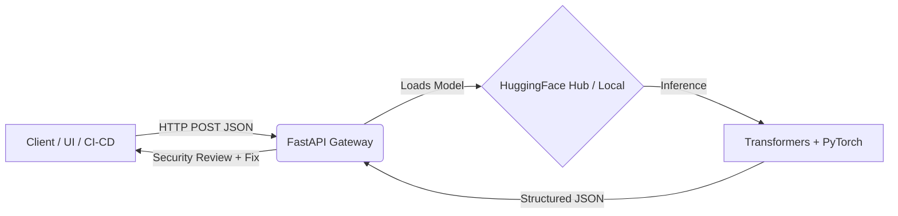

<div align="center">
  
  <h1>🛡️ ZeroVuln AI</h1>
  <p><strong>Next-Generation LLM Inference API for Smart Contract Security</strong></p>

  <p>
    <a href="#demo"></a>
    <a href="#tech-stack"></a>
    <a href="#tech-stack"></a>
    <a href="#tech-stack"></a>
  </p>
</div>

---

## 🌟 Executive Summary

Smart contract vulnerabilities cost the Web3 industry billions. Traditional auditing is slow, expensive, and scales poorly. **ZeroVuln AI** bridges this gap by providing a **production-ready HTTP API** powered by a domain-adapted LLM. It instantly identifies vulnerabilities in Solidity code and generates safer, actionable fixes.

Built for seamless integration, ZeroVuln AI acts as a drop-in security assistant for CI/CD pipelines, IDEs, and developer workflows, empowering teams to ship secure Web3 applications faster.

### 🏆 Why ZeroVuln AI Stands Out (For Judges)
- **End-to-End Security Flywheel**: From audited findings to curated data, to continuous training pipelines, ensuring our model gets smarter with every interaction.
- **Developer-First Design**: Clean RESTful `/generate` endpoint delivering predictable, structured JSON outputs ready for immediate automation and UI rendering.
- **Enterprise-Ready Deployment**: Lightweight containerized architecture using FastAPI + Uvicorn, supporting both local execution and cloud scaling.

---

## 🎥 Live Demo

See ZeroVuln AI in action: detecting vulnerabilities and auto-generating secure code within seconds.

<p align="center">
  <!-- Replace with actual demo GIF/Video URL -->
  
</p>

---

## 💡 The Problem & Our Solution

### The Problem
- **Bottleneck in Audits**: Human audits take weeks and cost thousands of dollars.
- **Inactionable Alerts**: Existing static analysis tools output noisy, false-positive-heavy reports without showing *how* to fix the issue.
- **Fragmented Workflows**: Security is often an afterthought rather than integrated directly into the developer's environment.

### Our Solution
ZeroVuln AI is an **LLM-in-the-loop security assistant** that provides:
1. **Context-Aware Analysis**: Understands complex Solidity logic.
2. **Actionable Remediation**: Doesn't just find the bug—it writes the patched code.
3. **Structured Triage**: Outputs JSON with severity, confidence scores, and line ranges for automated issue creation.

---

## 🏗️ Architecture & How It Works

ZeroVuln AI is designed for high performance and operational simplicity.



---

## 🚀 Tech Stack

We chose a modern, high-performance stack optimized for AI inference:
- **Core API**: [FastAPI](https://fastapi.tiangolo.com/) + Uvicorn
- **AI Runtime**: [HuggingFace Transformers](https://huggingface.co/docs/transformers/index) + [PyTorch](https://pytorch.org/)
- **Model Distribution**: HuggingFace Hub (`althof3/zeroVuln`)
- **Infrastructure**: Docker for reproducible, scalable deployments

---

## 🔌 API Reference

### Generate Security Review
**Endpoint:** `POST /generate`

**Request:**
```bash
curl -X POST http://localhost:8000/generate \
  -H 'Content-Type: application/json' \
  -d '{
    "prompt": "Analyze this Solidity contract for common vulnerabilities and propose fixes...",
    "system_prompt": "Return a structured security review and a safer corrected Solidity snippet."
  }'
```

**Health Check:** `GET /health`

---

## ⚙️ Configuration

Control the engine via environment variables:

| Variable | Default | Description |
|---|---|---|
| `MODEL_REPO` | `althof3/zeroVuln` | HuggingFace model repository to load |
| `MODEL_PATH` | *None* | Local directory for offline execution |
| `HF_TOKEN` | *None* | Required only for private/gated models |
| `DEVICE_MAP` | `auto` | GPU/CPU device mapping strategy |
| `TORCH_DTYPE` | `float16` | Precision type (`bf16`, `fp16`, `fp32`) |

---

## 🏃 Quickstart Guide

### Option 1: Local Environment

```bash
# 1. Setup virtual environment
cd ai
python3 -m venv venv
source venv/bin/activate

# 2. Install dependencies
pip install -r requirements.txt

# 3. Run the server
export MODEL_REPO=althof3/zeroVuln
python -m uvicorn inference_app.main:app --host 0.0.0.0 --port 8000
```

### Option 2: Docker (Recommended)

```bash
cd ai
docker build -t zerovuln-inference .
docker run --rm -p 8000:8000 \
  -e HF_TOKEN="your_token_here" \
  -e MODEL_REPO=althof3/zeroVuln \
  zerovuln-inference
```

---

## 📊 Impact & Metrics

ZeroVuln AI optimizes for speed, accuracy, and developer experience.

| Metric | Target / Benchmark | Why it matters |
|---|---|---|
| **Latency p95** | < 3 seconds | Seamless developer experience in CI/PR workflows. |
| **Actionability** | 95%+ | Developers can apply the suggested fix without manual rewrite. |
| **Precision** | > 85% | Reduces false positives, building trust with the security team. |
| **Coverage** | Top 10 OWASP Smart Contract | Protects against reentrancy, integer overflow, access control, etc. |

---

## 🗺️ Roadmap & Future Work

- [ ] **IDE Integration**: Direct plugins for VSCode and IntelliJ to provide real-time vulnerability highlighting.
- [ ] **Performance Optimization**: Implement vLLM / TensorRT for hyper-optimized inference speed.
- [ ] **Auto-Fix PRs**: GitHub App integration to automatically open Pull Requests with suggested fixes.
- [ ] **Multi-Chain Support**: Expanding support to Rust (Solana) and Move (Aptos/Sui).

---
<div align="center">
  <i>Built with ❤️ for a safer Web3 ecosystem.</i>
</div>
