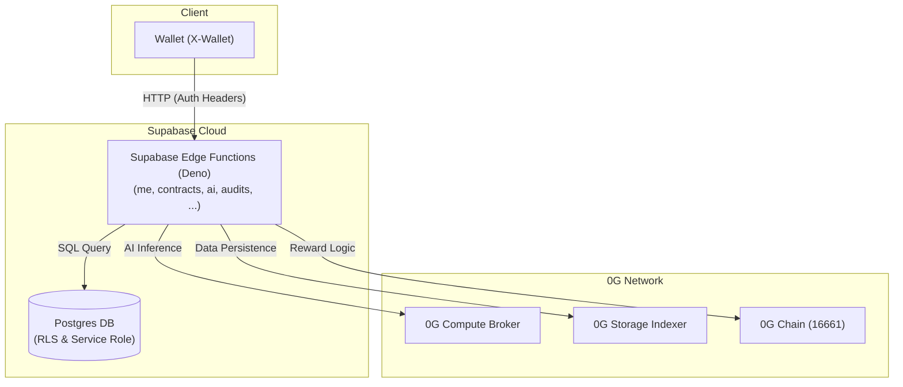
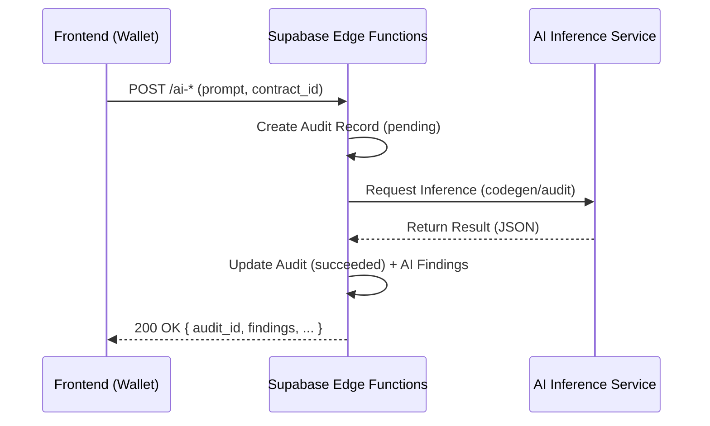
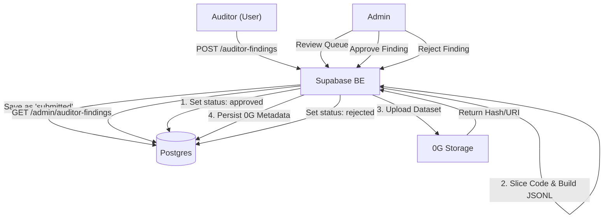

<div align="center">

# ZeroVuln — Backend

**AI-Powered Smart Contract Auditing, Decentralized on 0G**

Supabase Edge Functions (Deno) + Postgres, wired into the 0G stack for verifiable AI compute and tamper-proof dataset storage.

[](https://deno.land)
[](https://supabase.com)
[](https://0g.ai)
[](https://www.typescriptlang.org)

[API Docs](./API_FE_DOCS.md) · [Migrations](./supabase/migrations) · [0G Skill Index](./CLAUDE.md)

</div>

---

## Why ZeroVuln

Smart contract bugs cost the industry **billions per year**. ZeroVuln turns the audit workflow into a closed loop:

1. **AI auditor** — generates, audits, auto-fixes, and gas-optimizes Solidity in seconds.
2. **Human auditors** — contribute curated findings against catalog contracts and earn rewards.
3. **0G layer** — every approved finding becomes a JSONL training sample, persisted on **0G Storage**; inference jobs run through **0G Compute** for verifiable, decentralized AI.

The result is a self-improving security dataset that lives outside any single vendor.

---

## Architecture at a Glance



| Layer        | Tech                                                |
| ------------ | --------------------------------------------------- |
| HTTP         | Supabase Edge Functions on Deno 2.x                 |
| Database     | Postgres (Supabase managed, service-role access)    |
| AI Inference | 0G Compute Broker (HTTP) — codegen / audit / fix    |
| Dataset      | 0G Storage via `@0gfoundation/0g-ts-sdk@1.2.8`      |
| Signer       | `ethers` v6 on 0G mainnet (`chainId: 16661`)        |

---

## Project Layout

```
be/
├── supabase/
│   ├── config.toml                # Supabase CLI config
│   ├── migrations/                # Ordered SQL schema (init → expired_at → source_code jsonb)
│   └── functions/
│       ├── _shared/
│       │   ├── supabase.ts        # Wallet auth, response helpers, admin client
│       │   ├── og-storage.ts      # 0G Storage upload/download + Compute job APIs
│       │   └── mod.ts
│       ├── me/                    # GET /me — wallet profile + admin flag
│       ├── contracts/             # User contracts CRUD (is_catalog=false)
│       ├── contract_catalog/      # Public catalog + admin-only writes
│       ├── ai/                    # Inference triggers: codegen | audit
│       ├── audits/                # List + detail (polling target, embeds findings)
│       ├── ai-findings/           # GET / PATCH AI finding status
│       ├── auditor-findings/      # Human-contributed findings + submit flow
│       └── admin/                 # Review queue, approve (→ 0G Storage), reject
├── package.json                   # npm scripts for `supabase deploy`
├── deno.json                      # Deno config + import map
├── .env.example                   # Env template
├── API_FE_DOCS.md                 # Full request/response contract for the FE
└── CLAUDE.md                      # Internal 0G agent-skill index
```

---

## Authentication — Wallet First

ZeroVuln **does not use Supabase Auth**. Identity is derived from the user's EVM wallet, passed as a header:

```http
Authorization: Bearer <SUPABASE_ANON_KEY>
X-Wallet-Address: 0x…40-hex
```

`resolveUser()` in `_shared/supabase.ts` does the following on every request:

1. Validate the wallet format (`0x` + 40 hex chars).
2. Check it against `ADMIN_WALLETS` (comma-separated env) → mark `is_admin`.
3. `upsert` into `public.users` on `wallet_address` → return the row.
4. Promote new admin wallets if needed.

All public identifiers in the API are the `uuid` column. Internal FKs use `bigint id`.

---

## Database Schema (Concise)

> Source of truth: [`supabase/migrations/`](./supabase/migrations).

| Table               | Key Columns                                                                                                                                                            |
| ------------------- | ---------------------------------------------------------------------------------------------------------------------------------------------------------------------- |
| `users`             | `uuid`, `wallet_address` (unique), `is_admin`                                                                                                                          |
| `contracts`         | `uuid`, `owner_id`, `is_catalog`, `name`, `status`, `language`, `source_code jsonb[]`, `gas_estimate`, `reward_per_finding`, `expired_at`                              |
| `audits`            | `uuid`, `contract_id`, `kind` (`codegen \| audit`), `status` (`pending \| running \| succeeded \| failed`), `summary`, `started_at`, `completed_at` |
| `ai_findings`       | `uuid`, `audit_id`, `severity`, `title`, `description`, `line_start/end`, `confidence`, `gas_saved`, `status`, `reasoning_trace`, `remediation`, `attack_trace`        |
| `auditor_findings`  | `uuid`, `contributor_id`, `contract_id` (must be `is_catalog=true`, enforced by trigger), `review_status`, `submitted_at`, `decided_at`, `dataset_uri`, `dataset_hash` |

RLS is enabled on every table, but edge functions run with the **service role key**, so authorization is enforced at the application layer (`owner_id` / `is_admin` / `is_catalog` checks).

---

## API Surface

Full request/response shapes and cURL examples live in [`API_FE_DOCS.md`](./API_FE_DOCS.md).

| Resource              | Function            | Method · Path                                                                                  |
| --------------------- | ------------------- | ---------------------------------------------------------------------------------------------- |
| User profile          | `me`                | `GET /me`                                                                                      |
| User contracts        | `contracts`         | `GET / POST /contracts` · `GET / PATCH / DELETE /contracts/:uuid`                              |
| Catalog (public)      | `contract_catalog`  | `GET /contract_catalog` · `GET /contract_catalog/:uuid`                                        |
| Catalog (admin)       | `contract_catalog`  | `GET / POST /contract_catalog/admin` · `GET / PATCH /contract_catalog/admin/:uuid`             |
| AI triggers           | `ai`                | `POST /ai-codegen` · `/ai-audit` · `/ai-codegen-0g`<sup>🧪</sup> · `/ai-audit-0g`<sup>🧪</sup> → `200 { audit_id, ... }` |
| Audits                | `audits`            | `GET /audits?contract_id=&status=` · `GET /audits/:uuid` (polling, embeds `ai_findings`)       |
| AI findings           | `ai-findings`       | `GET / PATCH /ai-findings/:uuid`                                                               |
| Auditor contributions | `auditor-findings`  | `GET / POST /auditor-findings` · `GET / PATCH /auditor-findings/:uuid` · `PATCH …/submit`      |
| Admin review          | `admin`             | `GET /admin/auditor-findings?review_status=` · `POST …/:uuid/approve` \| `…/reject`            |

> <sup>🧪</sup> **Research preview.** The `/ai-codegen-0g` and `/ai-audit-0g` endpoints are tagged as **research-only** and are **not yet on the production hot path** — see [Research Preview: 0G Compute Endpoints](#research-preview-0g-compute-endpoints) below.

### AI Flow — Synchronous Execution

All AI endpoints are **synchronous**. The handler waits for the AI inference service to complete, writes results to the database, and returns the data immediately.



> Every AI request is synchronous to ensure immediate feedback within the developer's workflow.

### Auditor → 0G Storage Flow



1. User `POST /auditor-findings` against a catalog contract (auto `review_status=submitted`).
2. Admin reviews the queue via `GET /admin/auditor-findings`.
3. **Approve** (`POST …/:uuid/approve`):
   - Set `review_status=approved`, `decided_at=now()`.
   - Slice `source_code` by `line_start` / `line_end` → produce a JSONL instruction/input/output sample.
   - Upload to **0G Storage** (namespace `datasets`, key `auditor-findings/<uuid>.jsonl`).
   - Persist `dataset_uri` (root hash `0x…64hex` or fallback `0g://…`) and `dataset_hash` (tx hash or SHA-256 fallback).
4. **Reject** only flips status — no upload.

---

## Environment

Copy `.env.example` to `.env`. For deployed environments, use `supabase secrets set …`.

| Variable                    | Required | Description                                                                |
| --------------------------- | :------: | -------------------------------------------------------------------------- |
| `SUPABASE_URL`              |    ✓     | Supabase project URL                                                       |
| `SUPABASE_SERVICE_ROLE_KEY` |    ✓     | Service role key — used by every edge function (bypasses RLS)              |
| `ADMIN_WALLETS`             |    ✓     | Comma-separated wallets to promote to `is_admin=true`                      |
| `OG_CHAIN_ID`               |    –     | Defaults to `16661` (0G mainnet)                                           |
| `OG_RPC_URL`                |    –     | Defaults to `https://evmrpc.0g.ai`                                         |
| `OG_STORAGE_INDEXER`        |    –     | Defaults to `https://indexer-storage-turbo.0g.ai`                          |
| `OG_STORAGE_NODE`           |    –     | Legacy `POST /upload` fallback; defaults to `OG_STORAGE_INDEXER`           |
| `OG_PRIVATE_KEY`            |   ✓\*    | Signer for SDK uploads. Without it, uploads fall back to the legacy node   |
| `OG_COMPUTE_BROKER`         |   ✓\*    | 0G Compute broker HTTP endpoint. Required for any AI trigger to succeed    |
| `OG_COMPUTE_PROVIDER`       |    –     | Optional explicit 0G chatbot provider address. If unset, auto-discovered by matching `OG_COMPUTE_MODEL` |
| `OG_COMPUTE_MODEL`          |    –     | Model name routed for the `/ai-*-0g` endpoints. Defaults to `0GM-1.0-35B-A3B`             |
| `AI_API_KEY`                |   ✓\*    | API key for the default (`sumopod`) inference gateway used by `/ai-codegen` and `/ai-audit` |
| `AI_MODEL`                  |    –     | Defaults to `Qwen2.5-0.5B-Instruct` (overridable per job)                  |

`*` Endpoints stay reachable without these, but the feature itself will fail at execution time.

---

## Quick Start

### Prerequisites
- Supabase CLI ≥ 2.x
- Deno ≥ 2.x
- Docker (for `supabase start`)
- Node 18+ (only needed for `supabase deploy` via `npm run deploy`)

### Run Locally

```bash
cd be
cp .env.example .env             # fill in values
supabase start                   # boots Postgres + edge runtime
supabase functions serve --env-file .env
```

Local base URL: `http://127.0.0.1:54321/functions/v1`

Reset the DB and re-apply migrations:

```bash
supabase db reset
```

### Deploy

```bash
# deploy every function
npm run deploy                   # = supabase functions deploy

# or per function
supabase functions deploy contracts
supabase functions deploy ai
# …

# set secrets
supabase secrets set OG_PRIVATE_KEY=0x… OG_COMPUTE_BROKER=https://…

# push migrations to remote
supabase db push
```

---

## Edge Function Routing

Every function deploys to its own slug at `/functions/v1/<name>`. Inside each `index.ts`, the path after the function name is used for manual routing:

- `contracts/:uuid` → handler reads segment index 4 from `/functions/v1/contracts/<uuid>`.
- `ai/index.ts` routes on `pathParts[functionIndex + 2]` (`ai-codegen | ai-audit | ai-codegen-0g | ai-audit-0g`). Because Supabase has no native path multiplexing, the `ai` function is also deployed under each of those slugs (or rewritten on the FE) so the segment is always present. The `-0g` variants run inference on the **0G Compute Network** (`0GM-1.0-35B-A3B` by default) via the 0G Serving Broker, instead of the default sumopod gateway.

---

## Research Preview: 0G Compute Endpoints

> **Status:** 🧪 Research / experimental · **Not for production traffic** · Tracked under the **next-quarter dev roadmap**.

`POST /ai/ai-codegen-0g` and `POST /ai/ai-audit-0g` are functionally identical to their non-suffixed counterparts (`/ai-codegen`, `/ai-audit`) — same request body, same DB side effects, same response shape (with an added `"backend": "0g-compute"` marker). The only difference is the **inference backend**: instead of routing to the default sumopod gateway, requests are dispatched through the **0G Serving Broker** to the 0G Compute Network and answered by the model **`0GM-1.0-35B-A3B`** (35B-parameter MoE, ~3B active per token).

### Why "research-only"?

`0GM-1.0-35B-A3B` was published by 0G Labs on **14 May 2026** — only days before this commit. Because the model and its provider footprint are still very new, we are treating the two `-0g` endpoints as a **research surface** rather than a drop-in replacement for the existing AI triggers. Concretely:

- **Provider availability is still volatile.** At any given moment only a small handful of 0G chatbot providers may be serving `0GM-1.0-35B-A3B`. Auto-discovery (`OG_COMPUTE_PROVIDER` left empty) can therefore fail with `No 0G chatbot provider found for model "0GM-1.0-35B-A3B"`.
- **Output quality has not been benchmarked against our audit harness yet.** The existing prompts (`AI_CODEAUDIT_SYSTEM_PROMPT_V2`, `AI_CODEGEN_SYSTEM_PROMPT`) were tuned against Qwen / Gemini-class models. We expect the JSON-strictness and line-accuracy invariants to need prompt re-tuning for `0GM-1.0`.
- **Latency and cost characteristics are unknown.** Inference still funnels through `processResponse()` for on-chain fee settlement, which adds a non-trivial tail latency we have not yet profiled end-to-end inside an edge function's 60-second budget.
- **TEE-verification coverage for the new model is partial.** Some providers exposing `0GM-1.0-35B-A3B` are not yet TEE-attested — acceptable for experimentation, not yet for user-facing security workloads.

For these reasons the FE should keep calling `/ai-codegen` and `/ai-audit` as the **default** path. The `-0g` endpoints are intentionally available so the team (and curious early adopters) can validate the model, capture benchmarks, and iterate on prompts — without forking the codebase.

### Roadmap

The graduation plan for the `-0g` endpoints, once the model stabilises:

1. **Prompt re-tuning** against `0GM-1.0-35B-A3B` — restore the JSON-only / line-accuracy guarantees on the audit & codegen prompts for this model family.
2. **Bench suite** — run the existing audit fixtures (reentrancy, access-control, arithmetic, DoS) through both backends and publish a head-to-head report (severity recall, false-positive rate, code-fix compile success).
3. **TEE-verified provider pinning** — set a curated allow-list via `OG_COMPUTE_PROVIDER` so the auto-discovery path can only fall onto attested providers.
4. **Latency budgeting** — measure end-to-end `ogChatCompletion()` against the Supabase edge timeout; introduce streaming + early-flush if needed.
5. **Promotion** — once steps 1–4 are green, swap the default `/ai-codegen` / `/ai-audit` handlers to call `ogChatCompletion()` and retire the sumopod gateway (keeping the `-0g` slugs as permanent aliases for backwards compatibility).

Until then: **treat `/ai-codegen-0g` and `/ai-audit-0g` as experimental endpoints**, useful for research and for showcasing end-to-end 0G integration, and expect breaking changes / occasional 5xx responses while the underlying model and provider network mature.

---

## Error Shape

Every error response follows this shape:

```json
{ "error": { "code": "BAD_REQUEST", "message": "…" } }
```

| Code             | HTTP |
| ---------------- | ---: |
| `UNAUTHORIZED`   |  401 |
| `FORBIDDEN`      |  403 |
| `NOT_FOUND`      |  404 |
| `BAD_REQUEST`    |  400 |
| `INTERNAL_ERROR` |  500 |

---

## References

- **[API_FE_DOCS.md](./API_FE_DOCS.md)** — full request/response contract + cURL for every endpoint.
- **[CLAUDE.md](./CLAUDE.md)** — index of 0G agent skills (storage, compute, chain) for SDK pattern lookups.
- **[supabase/migrations/](./supabase/migrations/)** — authoritative DB schema history.

---

<div align="center">

Decentralized AI Security Infrastructure · Powered by **Supabase + 0G Network**

</div>
