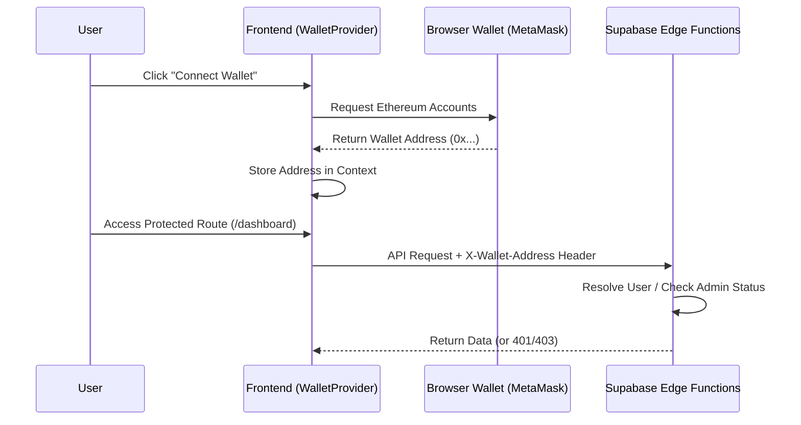
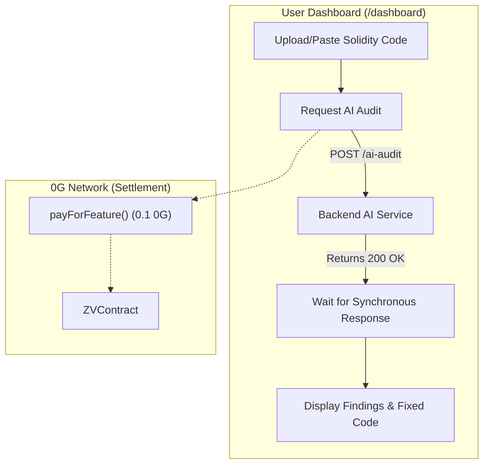
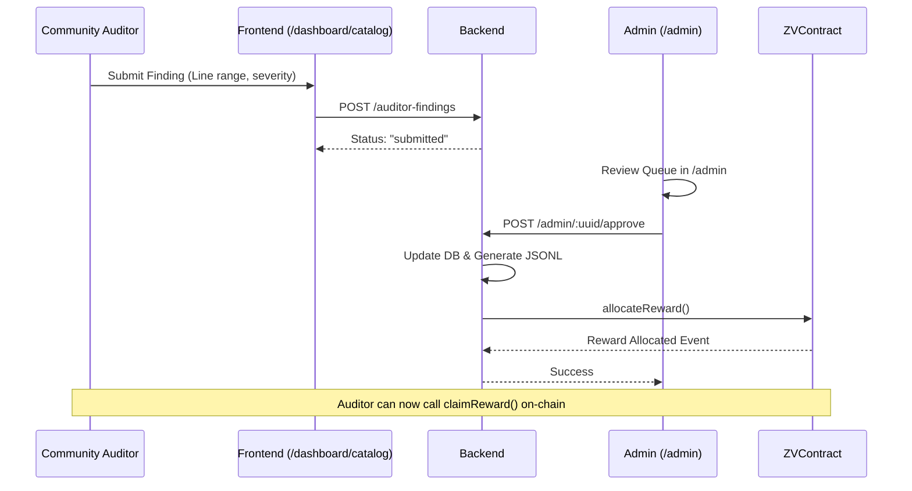

<div align="center">

# ZeroVuln — Frontend

**The decentralized dashboard for smart contract security, AI-powered auditing, and community bounty management.**

[](https://nextjs.org)
[](https://tailwindcss.com)
[](https://ui.shadcn.com/)
[](https://docs.ethers.org/v6/)

[Backend](../be) · [Training Pipeline](../scripts) · [Smart Contract](../smart-contract)

</div>

---

## 🏗️ Project Structure

The ZeroVuln frontend is built using **Next.js (App Router)** and follows a modular structure to separate concerns between UI components, business logic, and API communication.

```text
fe/
├── src/
│   ├── app/                # Next.js App Router (Pages & Layouts)
│   │   ├── (index)/        # Public landing page
│   │   ├── admin/          # Admin dashboard for reviewing findings
│   │   └── dashboard/      # User dashboard for submitting & auditing contracts
│   ├── shared/             # Reusable UI components & utilities
│   │   ├── components/     # UI building blocks (shadcn/ui & custom)
│   │   ├── contexts/       # React contexts (e.g., WalletProvider)
│   │   ├── hooks/          # Custom React hooks
│   │   └── utils/          # Helper functions and constants
│   └── api/                # Backend API integration and types
├── public/                 # Static assets
├── next.config.ts          # Next.js configuration
└── components.json         # shadcn/ui configuration
```

---

## 🚀 Key Flows

To help judges evaluate the user experience and integration logic, here are the primary workflows of the ZeroVuln frontend:

### 1. Authentication & Wallet Connection

ZeroVuln uses a wallet-first approach. There are no traditional usernames or passwords. The user's identity is their EVM wallet address.



### 2. User Workflow (Smart Contract Auditing)

This is the primary flow for developers who want to analyze their smart contracts using ZeroVuln's AI.



### 3. Community Auditor & Admin Workflow

This flow details how human security researchers contribute to the catalog and how admins review and approve these findings to train the AI.



---

## 🛠️ Tech Stack & Decisions

- **Framework**: [Next.js 15](https://nextjs.org/) (App Router) for server-side rendering, optimized routing, and SEO.
- **Styling**: [Tailwind CSS](https://tailwindcss.com/) for rapid, utility-first styling.
- **Components**: [shadcn/ui](https://ui.shadcn.com/) for accessible, customizable, and unstyled base components.
- **Web3 Integration**: [ethers.js v6](https://docs.ethers.org/v6/) for interacting with the 0G Mainnet (default) and the `ZVContract`.
- **Icons**: Huge Icons for consistent, crisp iconography.

## 💻 Getting Started Locally

1. **Clone the repository** and navigate to the `fe` directory.
2. **Install dependencies**:
   ```bash
   npm install
   # or
   bun install
   ```
3. **Set up environment variables**:
   Create a `.env` file and add the required variables (see `.env.example` for examples).
   ```env
   NEXT_PUBLIC_SUPABASE_URL=...
   NEXT_PUBLIC_SUPABASE_ANON_KEY=...
   NEXT_PUBLIC_API_URL=...
   NEXT_PUBLIC_ZV_CONTRACT_ADDRESS=...
   # optional: "mainnet" (default) or "testnet"
   NEXT_PUBLIC_OG_NETWORK=mainnet
   # optional: override RPC/explorer (recommended for production redundancy)
   NEXT_PUBLIC_OG_RPC_URL_MAINNET=https://evmrpc.0g.ai
   NEXT_PUBLIC_OG_EXPLORER_URL_MAINNET=https://chainscan.0g.ai
   NEXT_PUBLIC_OG_RPC_URL_TESTNET=https://evmrpc-testnet.0g.ai
   NEXT_PUBLIC_OG_EXPLORER_URL_TESTNET=https://chainscan-galileo.0g.ai
   ```
4. **Run the development server**:
   ```bash
   npm run dev
   # or
   bun dev
   ```
5. Open [http://localhost:3000](http://localhost:3000) in your browser.
