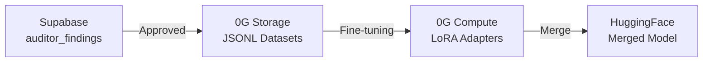
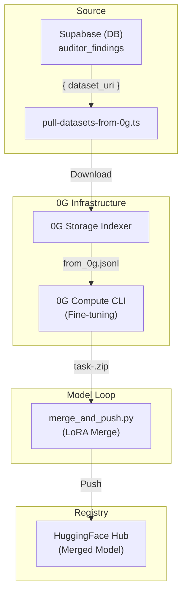
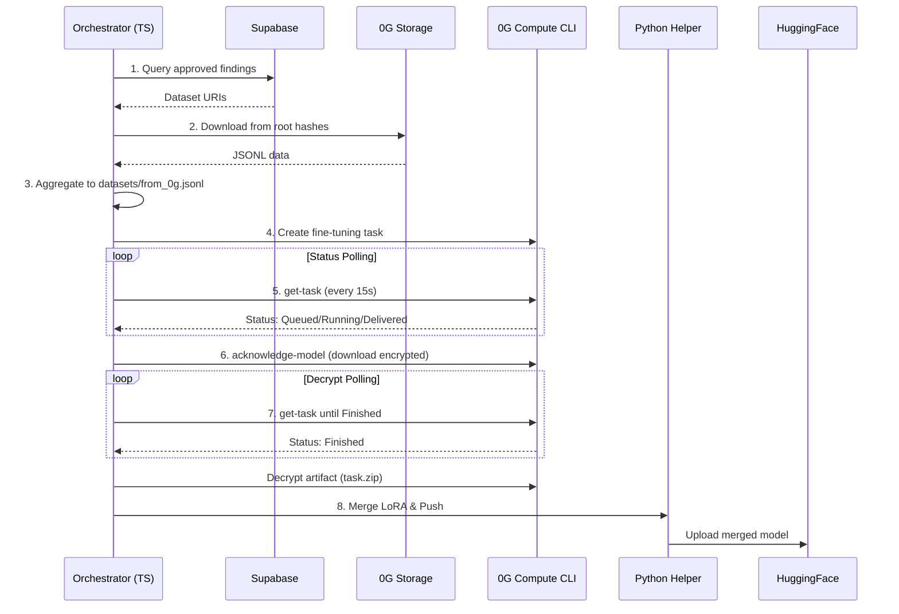

<div align="center">

# ZeroVuln — Training Pipeline

**From verified human findings → 0G Storage → 0G Compute fine-tuning → HuggingFace**

Standalone CLI scripts that close the loop between auditor contributions and a continuously improving Solidity-auditing LLM.

[](https://nodejs.org)
[](https://www.python.org)
[](https://0g.ai)
[](https://0g.ai)
[](https://huggingface.co/Qwen)

[Backend](../be) · [Frontend](../fe) · [0G Skill Index](../be/CLAUDE.md)

</div>

---

## What This Folder Does

ZeroVuln's audit data is curated by humans, persisted on **0G Storage**, and recycled into the AI auditor itself. This folder is the pipeline that makes that loop real:



One command (`npm run pull-and-fine-tune`) drives the whole sequence end-to-end. The orchestration lives in TypeScript; the merge + push step is a small Python helper that uses `peft` + `huggingface_hub`.

> Kept separate from `be/` because the Supabase Edge Functions runtime (Deno) cannot run PyTorch, `0g-compute-cli`, or invoke spawned subprocesses with the same flexibility.

---

## Pipeline at a Glance



---

## Files

| File                        | Purpose                                                                                                  |
| --------------------------- | -------------------------------------------------------------------------------------------------------- |
| `pull-datasets-from-0g.ts`  | Main TypeScript orchestrator — Supabase query, 0G download, optional 0G Compute fine-tune, Python invoke |
| `merge_and_push.py`         | Unzip LoRA adapter, `merge_and_unload` into the base model, push to HuggingFace                          |
| `config-train.json`         | Default training hyperparameters fed to `0g-compute-cli fine-tuning create-task`                         |
| `package.json`              | TS deps (`tsx`, `@0gfoundation/0g-storage-ts-sdk`, `@supabase/supabase-js`, `ethers`, `dotenv`)          |
| `requirements.txt`          | Python deps (`torch`, `transformers`, `peft`, `huggingface_hub`, `safetensors`, `accelerate`)            |
| `datasets/`                 | Output JSONL aggregated from approved auditor findings (gitignored)                                      |
| `fine_tuned_model/`         | Encrypted/decrypted adapters + merged model per task (gitignored)                                        |

---

## Prerequisites

- **Node.js 18+** and **npm**
- **Python 3.10+** with `pip` (recommend a `.venv`)
- **`0g-compute-cli`** installed and authenticated (`setup-network` + `login`)
- 0G Compute account funded:
  - `0g-compute-cli deposit --amount 3`
  - `0g-compute-cli transfer-fund --provider 0x... --amount 2 --service fine-tuning`
- A **HuggingFace** token with write access (for the push step)
- Read access to the **Supabase** project (`SUPABASE_SERVICE_ROLE_KEY`)

---

## Install

```bash
cd scripts

# 1) TypeScript orchestrator
npm install

# 2) Python merge/push helper (use a venv to keep things clean)
python3 -m venv .venv
source .venv/bin/activate
pip install -r requirements.txt

# 3) 0G Compute CLI bootstrap (one time)
0g-compute-cli setup-network
0g-compute-cli login
0g-compute-cli deposit --amount 3
0g-compute-cli transfer-fund --provider 0x<PROVIDER> --amount 2 --service fine-tuning
```

---

## Environment

Create `scripts/.env` (gitignored) with at minimum:

```env
# --- Supabase (required) ---
SUPABASE_URL=https://<project>.supabase.co
SUPABASE_SERVICE_ROLE_KEY=eyJhbGciOi...

# --- 0G Storage (optional; defaults to testnet turbo indexer) ---
OG_STORAGE_INDEXER=https://indexer-storage-testnet-turbo.0g.ai
OG_STORAGE_NODE=https://indexer-storage-testnet-turbo.0g.ai

# --- 0G Compute fine-tuning (required when using --fine-tune) ---
OG_COMPUTE_CLI=0g-compute-cli
OG_PROVIDER=0x<provider-wallet>
OG_MODEL=Qwen2.5-0.5B-Instruct
OG_CONFIG_PATH=./config-train.json
OG_MODEL_OUT_DIR=./fine_tuned_model
OG_POLL_INTERVAL_MS=15000
OG_POLL_TIMEOUT_MS=3600000

# --- Merge + Push (required unless --skip-push) ---
PYTHON_BIN=python3
MERGE_SCRIPT=./merge_and_push.py
HF_BASE_MODEL=Qwen/Qwen2.5-0.5B-Instruct   # auto-resolved for known models
HF_REPO_ID=<your-username>/zerovuln-qwen2.5-0.5b
HF_TOKEN=hf_xxx
HF_PRIVATE=false
```

> **Tip:** every env var has a matching CLI flag — see [Usage](#usage). Flags always win.

---

## Usage

### Pull approved findings only (no fine-tune)

```bash
npm run pull-datasets -- --limit 500
```

This appends approved `auditor_findings.dataset_uri` content (downloaded from 0G Storage) to `./datasets/from_0g.jsonl`.

### Pull + fine-tune + merge + push (the full loop)

```bash
npm run pull-and-fine-tune -- \
  --limit 200 \
  --provider 0x<provider-wallet> \
  --model Qwen2.5-0.5B-Instruct \
  --config-path ./config-train.json \
  --hf-repo-id <user>/zerovuln-qwen2.5-0.5b \
  --hf-token hf_xxx
```

What happens, step by step:



1. **Query Supabase** — newest `limit` approved `auditor_findings` with non-null `dataset_uri`.
2. **Download from 0G Storage** — root-hash entries via the SDK indexer, legacy `0g://…` paths via HTTP.
3. **Aggregate** — write each line into `./datasets/from_0g.jsonl`.
4. **Create fine-tune task** — `0g-compute-cli fine-tuning create-task`.
5. **Poll** every 15s until status reaches `Delivered` / `UserAcknowledged` / `Finished`.
6. **Acknowledge** the encrypted model artifact to `./fine_tuned_model/task-<id>.encrypted`.
7. **Poll** again until `Finished`, then **decrypt** to `task-<id>.zip`.
8. **Merge + push** — unzip the LoRA adapter, `merge_and_unload` it into the HF base model, upload the merged folder to your HF repo.

### Skip the HF upload (debug/inspect only)

```bash
npm run pull-and-fine-tune -- --skip-push --limit 50
```

---

## CLI Flags Reference

| Flag                  | Env                   | Default                          | Notes                                          |
| --------------------- | --------------------- | -------------------------------- | ---------------------------------------------- |
| `--out-file`          | —                     | `./datasets/from_0g.jsonl`       | Aggregated JSONL output                        |
| `--limit`             | —                     | `200`                            | Number of approved findings to pull            |
| `--no-verify`         | —                     | verified ON                      | Disable 0G Storage merkle verification         |
| `--fine-tune`         | —                     | off                              | Trigger the fine-tune → push pipeline          |
| `--cli-bin`           | `OG_COMPUTE_CLI`      | `0g-compute-cli`                 | Path to the 0G CLI binary                      |
| `--provider`          | `OG_PROVIDER`         | —                                | Compute provider wallet (required for FT)      |
| `--model`             | `OG_MODEL`            | —                                | e.g. `Qwen2.5-0.5B-Instruct`                   |
| `--config-path`       | `OG_CONFIG_PATH`      | —                                | Training config JSON (see below)               |
| `--model-out-dir`     | `OG_MODEL_OUT_DIR`    | `./fine_tuned_model`             | Where artifacts and `task-*` work dirs live    |
| `--poll-interval-ms`  | `OG_POLL_INTERVAL_MS` | `15000`                          | Poll cadence for `get-task`                    |
| `--poll-timeout-ms`   | `OG_POLL_TIMEOUT_MS`  | `3600000` (1 h)                  | Hard timeout per poll loop                     |
| `--python-bin`        | `PYTHON_BIN`          | `python3`                        | Python interpreter for the merge step          |
| `--merge-script`      | `MERGE_SCRIPT`        | `./merge_and_push.py`            | Path to the merge/push helper                  |
| `--hf-base-model`     | `HF_BASE_MODEL`       | auto-resolved when possible      | HuggingFace repo id of the base model          |
| `--hf-repo-id`        | `HF_REPO_ID`          | —                                | Destination repo (`org/name`)                  |
| `--hf-token`          | `HF_TOKEN`            | —                                | HuggingFace write token                        |
| `--hf-private`        | `HF_PRIVATE=true`     | public                           | Create the target repo as private              |
| `--skip-push`         | —                     | push on                          | Stop after decrypt; skip merge + upload        |

---

## Training Config (`config-train.json`)

A minimal LoRA-friendly default — tune to taste:

```json
{
  "neftune_noise_alpha": 5,
  "num_train_epochs": 1,
  "per_device_train_batch_size": 2,
  "learning_rate": 0.0002,
  "max_steps": 3
}
```

These are passed through to `0g-compute-cli fine-tuning create-task --config-path`. For more aggressive runs, raise `num_train_epochs` / `max_steps` and watch the provider's per-step pricing.

---

## Output Artifacts

After a successful run, expect this layout:

```
scripts/
├── datasets/
│   └── from_0g.jsonl                                # aggregated training data
└── fine_tuned_model/
    └── task-<uuid>/
        ├── adapter_config.json                      # extracted LoRA adapter
        ├── adapter_model.safetensors
        ├── …
        └── merged/                                  # base + adapter, ready to ship
            ├── config.json
            ├── model.safetensors
            ├── tokenizer.json
            └── …
```

The `merged/` folder is what gets uploaded to `https://huggingface.co/<HF_REPO_ID>`.

---

## Troubleshooting

| Symptom                                                        | Likely Cause / Fix                                                                                       |
| -------------------------------------------------------------- | -------------------------------------------------------------------------------------------------------- |
| `Missing env var: SUPABASE_URL`                                | `.env` not loaded — confirm `scripts/.env` exists and `dotenv/config` import is reachable                |
| `0G download failed for <hash>`                                | Storage indexer rejected the root hash. Retry with `--no-verify` to bypass merkle check (debug only)     |
| `[0g-cli] create-task failed`                                  | Account not funded or wrong provider. Re-check `deposit` + `transfer-fund` and `--provider` value        |
| `[0g-cli] timed out waiting for Delivered`                     | Provider is slow. Increase `--poll-timeout-ms`; some providers take >1h depending on dataset size        |
| `acknowledge-model failed`                                     | The 48 h ack window may have expired. Re-run from `create-task`                                          |
| `HuggingFace base model "X" is not a valid repo id`            | Pass `--hf-base-model Qwen/Qwen2.5-0.5B-Instruct` (or whichever) explicitly                              |
| `Missing HF token`                                             | Set `HF_TOKEN` or pass `--hf-token`. Token must have **write** scope on the destination repo             |

---

## Operational Notes

- **Reproducibility.** Every fine-tune produces a `task-<uuid>` directory; keep the encrypted artifact (`.encrypted`) and adapter zip (`.zip`) if you need to re-merge later without re-paying compute.
- **Cost.** Funding (`deposit` + `transfer-fund`) drains as tasks run. Check balances with `0g-compute-cli ledger` between runs.
- **Idempotency.** `pull-datasets` *appends* to `from_0g.jsonl`. Truncate the file manually if you want a clean dataset per run.
- **Privacy.** Pass `--hf-private` (or `HF_PRIVATE=true`) when iterating internally; flip to public for the demo repo.

---

## References

- **[0G Compute Fine-Tuning Docs](https://docs.0g.ai)** — task lifecycle, ack window, decrypt flow
- **[0G Storage SDK](https://github.com/0gfoundation/0g-storage-ts-sdk)** — root-hash download API
- **[PEFT / LoRA Merging](https://huggingface.co/docs/peft/main/en/developer_guides/lora)** — `merge_and_unload` semantics
- **[`be/README.md`](../be/README.md)** — where approved findings get persisted to 0G Storage in the first place

---

<div align="center">

Built for the **0G Hackathon** · Closing the loop between human auditors and AI

</div>
