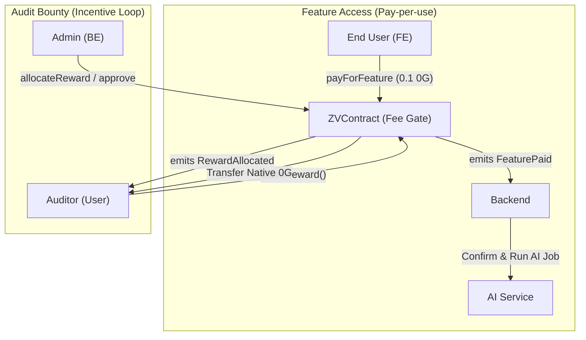

<div align="center">

# ZeroVuln — Smart Contract

### `ZVContract` · The On-Chain Settlement Layer

**Pay-per-use AI auditing · Bounty-style rewards for human auditors · Built for 0G Mainnet**

[](https://soliditylang.org)
[](https://hardhat.org)
[](https://0g.ai)
[](https://docs.soliditylang.org/en/latest/security-considerations.html)
[]()

[Backend](../be) · [Frontend](../fe) · [Training Pipeline](../scripts)

</div>

---

## Why It Matters

ZeroVuln isn't only AI — it's a **bounty economy** for smart-contract security:

> Every AI call pays a fee. Every approved human finding earns a reward. Every reward is claimable on-chain. Solvency is enforced by the contract itself.

`ZVContract` is the trust anchor that makes that loop tamper-evident: backend / FE never custody funds, and judges (or anyone) can verify the flow by reading events on 0G Mainnet.

---

## The Flow



---

## Feature Matrix

| Capability                        | Function                              | Caller     | Notes                                                  |
| --------------------------------- | ------------------------------------- | ---------- | ------------------------------------------------------ |
| Pay for a feature (CodeGen)       | `payForFeature(Feature, refId)`       | anyone     | Refunds excess automatically                           |
| Pay for a feature (Analyze)       | `payForFeature(Feature, refId)`       | anyone     | `refId` can carry contract/audit uuid hash             |
| Allocate reward (manual amount)   | `allocateReward(findingId, to, amt)`  | admin      | Anti-double-allocate via `rewardAllocated`             |
| Allocate reward (catalog config)  | `allocateRewardFromCatalog(...)`      | admin      | Pulls from `catalogRewardPerFinding[catalogId]`        |
| Claim accumulated rewards         | `claimReward()`                       | submitter  | Pull-over-push, reentrancy-guarded                     |
| Set per-catalog reward            | `setCatalogReward(catalogId, wei)`    | admin      | `catalogId = keccak256(bytes(catalog_uuid))`           |
| Update feature fee                | `setFeatureFee(newFee)`               | owner      | Default `0.1 ether` (= 0.1 0g)                         |
| Grant / revoke admin              | `setAdmin(addr, enabled)`             | owner      | Multiple admins allowed                                |
| Top-up contract for rewards       | `fund()` / `receive()`                | anyone     | Emits `Funded`                                         |
| Withdraw fee revenue              | `ownerWithdraw(to, amount)`           | owner      | **Cannot** dip into outstanding rewards                |

---

## Security Properties

- **Solvency invariant.** `address(this).balance ≥ totalOutstandingRewards` at all times — enforced on both `allocateReward*` and `ownerWithdraw`.
- **Pull-over-push payouts.** Rewards accrue to `claimableRewards[submitter]`; the recipient triggers the transfer, so a malicious receiver can't grief the admin path.
- **CEI ordering.** State updates always precede external calls. `claimReward()` zeroes the balance and decrements `totalOutstandingRewards` *before* sending native value.
- **Minimal reentrancy guard.** A single `_locked` flag wraps every value-moving function (`payForFeature`, `claimReward`, `ownerWithdraw`).
- **Replay-safe rewards.** `rewardAllocated[findingId]` prevents the same finding being credited twice.
- **Custom errors only.** Cheaper revert paths and explicit failure types (`InvalidFee`, `InsufficientContractBalance`, `AlreadyAllocated`, …).

---

## Events (the off-chain integration surface)

| Event                                                            | When it fires                                  | Who consumes it          |
| ---------------------------------------------------------------- | ---------------------------------------------- | ------------------------ |
| `FeaturePaid(payer, feature, amount, refId)`                     | User pays for CodeGen / Analyze                | BE — confirms before AI  |
| `RewardAllocated(findingId, submitter, amount)`                  | Admin approves a finding                       | FE — auditor inbox       |
| `CatalogRewardUpdated(catalogId, rewardPerFinding)`              | Admin configures bounty for a catalog          | FE — catalog detail page |
| `RewardClaimed(submitter, amount)`                               | Auditor withdraws                              | FE — wallet history      |
| `Funded(from, amount)`                                           | Anyone tops up the reward pool                 | BE — treasury monitoring |
| `OwnerWithdraw(to, amount)` / `AdminSet` / `FeatureFeeUpdated`   | Governance operations                          | Audit trail / dashboard  |

---

## Deploy

> Prerequisites: Node 18+, an EOA funded with 0G mainnet tokens, deployer private key.

```bash
cd smart-contract
cp .env.example .env            # fill PRIVATE_KEY and (optional) RPC_URL_MAINNET / RPC_URL_TESTNET
npm install
npm run compile
npm run deploy                  # default: mainnet
```

The script prints the deployed `ZVContract` address. Hardhat loads `.env` via `dotenv` — see [`hardhat.config.js`](./hardhat.config.js).

### Network

| Setting       | Mainnet                                  | Testnet (Galileo) |
| ------------- | ---------------------------------------- | ----------------- |
| Network name  | `mainnet`                                 | `testnet` / `galileo` |
| Chain ID      | `16661`                                   | `16602` |
| Default RPC   | `https://evmrpc.0g.ai`                    | `https://evmrpc-testnet.0g.ai` |
| Explorer      | `https://chainscan.0g.ai`                 | `https://chainscan-galileo.0g.ai` |
| Native token  | `0G` (18 decimals, used for fees & rewards) | `0G` |

Deploy ke testnet (opsional):

```bash
npm run deploy:testnet
```

---

## Integration Env

After deployment, propagate the address to the rest of the stack:

- **Frontend** — `NEXT_PUBLIC_ZV_CONTRACT_ADDRESS=<address>`
- **Backend (Supabase Function secrets)** — `ZV_CONTRACT_ADDRESS=<address>`

```bash
# example
supabase secrets set ZV_CONTRACT_ADDRESS=0x...
```

---

## Files

```
smart-contract/
├── contracts/
│   └── ZVContract.sol           # the contract (Solidity 0.8.20, ~250 lines)
├── scripts/
│   └── deploy.js                # hardhat deploy script
├── hardhat.config.js            # solc + galileo network config
├── package.json                 # hardhat + ethers
└── README.md                    # you are here
```

---

## Useful References

- **[`contracts/ZVContract.sol`](./contracts/ZVContract.sol)** — single source of truth for fees, rewards, and events.
- **[`../be/README.md`](../be/README.md)** — backend integration of fee verification and admin approval flow.
- **[`../scripts/README.md`](../scripts/README.md)** — how approved findings feed the AI training loop.

---

<div align="center">

The Trust Anchor for Decentralized AI Security · Bridge between AI and human auditors

</div>
